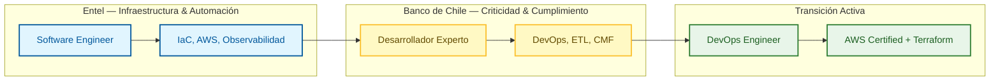

# Iván Durán Luengo
## DevOps Engineer | Platform Engineering | SRE

Santiago, Chile | [ivanduranluengo@gmail.com](mailto:ivanduranluengo@gmail.com)
[LinkedIn](https://www.linkedin.com/in/ivan-duran) | [GitHub](https://github.com/ElGlitches) | [CV Web](https://elglitches.github.io/ivan-duran-cv/)

---

## Perfil Profesional

Ingeniero con 4 años de experiencia en infraestructura crítica para banca y telecomunicaciones. Especializado en automatización con Python y Bash, pipelines CI/CD, orquestación de procesos y observabilidad en entornos de alta disponibilidad regulados por CMF.

Mentalidad SRE: si algo es manual y repetitivo, existe para ser automatizado.

Actualmente en preparación final para certificación **AWS Solutions Architect Associate** (formación con Adrian Cantrill) y profundizando en Terraform e IaC. Busco rol como **Individual Contributor** en DevOps o Platform Engineering, enfocado en construir plataformas estables y eliminar fricción operacional.

---

---

## Experiencia Profesional

### Banco de Chile — Desarrollador Experto, DevOps & Data Engineering
*Julio 2023 – Agosto 2025 | Santiago, Chile*
*(Top-3 banco chileno por activos, regulación CMF estricta, +1MM clientes)*

- **Automatización:** Orquestación de mallas de procesos bancarios críticos con Control-M y Bash, garantizando disponibilidad 24/7 sin intervención manual.
- **ETL & Datos:** Diseño de pipelines con DataStage y BigQuery (GCP) que redujeron el tiempo de disponibilidad de datos en un **40%**, habilitando decisiones de negocio en tiempo real.
- **CI/CD:** Migración de scripts críticos a GitHub Actions, reemplazando procesos manuales por flujos auditables alineados a estándares de auditoría bancaria.
- **Cumplimiento & Seguridad:** Integridad de datos bajo normativa CMF y modernización de sistemas legacy hacia arquitecturas cloud sin interrupción de servicio.

### Entel — Software Engineer, Infrastructure & Automation
*Agosto 2021 – Marzo 2023 | Santiago, Chile*
*(Mayor operadora de telecomunicaciones de Chile, +10M clientes)*

- **IaC:** Estandarización del despliegue de servidores productivos con Ansible y Bash, automatizando el **60% de las intervenciones manuales** en servicios críticos.
- **Contenedores & AWS:** Gestión de ecosistemas con AWS ECS y EC2 con Docker, asegurando despliegues consistentes y elásticos para plataformas de alta demanda.
- **Observabilidad:** Implementación proactiva con New Relic: dashboards, alertas y detección de incidentes antes de impactar al cliente.
- **IA & Automatización:** Integración de modelos IBM Watson en flujos de atención al cliente, convirtiendo procesos manuales en servicios automáticos escalables.

### Transición Técnica — DevOps & Cloud Engineering
*Agosto 2025 – Presente*

- Formación intensiva en AWS Cloud Architecture con Adrian Cantrill (Solutions Architect Associate, en proceso final).
- Desarrollo de proyectos open source: motor de análisis laboral con IA y plataforma SaaS legal para abogados.
- Foco en infraestructura cloud, automatización y eliminación de trabajo manual operacional.

---

## Proyectos Personales

### [Cloud-AI-Job-Engine](https://github.com/ElGlitches/Cloud-AI-Job-Engine)
Plataforma de inteligencia de mercado laboral. Scraping multi-fuente con Playwright, pipeline de análisis con Gemini 2.0 Flash, sincronización automática a Google Sheets vía API y ejecución desatendida con Cron. Arquitectura modular: backend, AI core, data engineering e infraestructura. Docker-ready. **Reduce el tiempo de revisión manual en un 90%.**

### [Agente Judicial — SaaS Legal AI](https://github.com/ElGlitches/agente-judicial)
Plataforma SaaS self-hosted para redacción legal asistida por IA. Integración con la Biblioteca del Congreso Nacional para validación normativa en tiempo real, generación de documentos Word con fidelidad de formato y sistema de gestión de usuarios con créditos y paywall. Stack: Python, Gemini, ChromaDB, SQLite, Docker. **En uso activo por abogados.**

---

## Habilidades Técnicas

| Área | Tecnologías |
|---|---|
| **DevOps & Automatización** | Ansible, Bash, GitHub Actions, Control-M, Docker, DataStage |
| **Cloud** | AWS (ECS, Lambda, EC2, S3, CloudWatch) · GCP (BigQuery, Cloud Run) |
| **SRE & Observabilidad** | New Relic, CloudWatch, estrategias de disponibilidad y resiliencia |
| **Lenguajes** | Python (avanzado), SQL avanzado, Bash/Unix Scripting |
| **Bases de datos** | PostgreSQL, BigQuery, Oracle, SQL Server, SQLite |
| **AI & Automatización** | RAG, ChromaDB, Gemini API, n8n, Playwright |
| **En desarrollo** | Terraform · Kubernetes · AWS Solutions Architect (cert. en curso) |
| **Inglés** | Lectura y escritura técnica avanzada |

---

## Educación y Certificaciones

- Ingeniería en Computación e Informática | UNAB (En curso)
- Analista Programador Computacional | Duoc UC (Titulado)
- AWS Certified Solutions Architect – Associate | En preparación final · Formación con Adrian Cantrill

